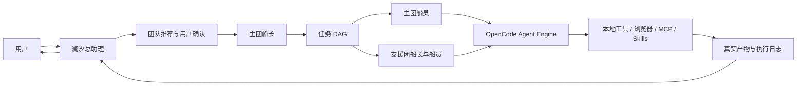

<div align="center">
  
  <h1>星潮航局 · Xingchao Navigation</h1>
  <p><strong>本地优先、会交付真实文件的多 Agent 桌面工作台</strong></p>
  <p>原创航海世界观 · 动态团队主题 · Windows / macOS · 自带模型接入</p>
</div>

> 当前状态：早期开发版。核心桌面壳、十个原创航海团、六十名 Agent、航海图、动态主题与补给包管理器已经进入代码；生产级 Live2D、完整五层记忆、导入包运行时激活、签名和公开发行仍在推进。

## 它解决什么问题

多数 Agent 产品只给出一段建议。星潮航局的目标是让一个女性总助理“澜汐”理解目标、推荐团队、组织分工、申请敏感权限、操作真实工具，并交付可直接打开的文档、表格、代码、图片或项目文件。

这不是角色扮演聊天软件。航海叙事负责辨识度和决策风格，专业能力、工具权限、事实核验与交付标准保持独立、可审计。

## 当前能力

- **澜汐总助理**：面向用户的唯一主控人格，负责目标澄清、选团建议、协调和最终复核。
- **十团六十人**：战略调研、写作传播、品牌设计、软件研发、数据财务、项目行政、法务风险、学习知识、多媒体和生活旅行。
- **航海图**：生成任务 DAG，选择一个主团和最多两个支援团，确认后再派发到 Agent 内核。
- **动态换肤**：主团切换时同步改变颜色、纹理、导航装饰和角色舞台；支援团只提供辅助色。
- **真实执行**：继承成熟的本地文件、终端、集成浏览器、审批、MCP/OpenConnector、Skills 和产物预览链路。
- **自带模型**：支持用户配置 OpenAI-compatible 模型；API Key 由 Electron `safeStorage` 加密，渲染层无法读取。
- **补给仓**：导入、列出和移除声明式内容包。主进程执行版本、路径、类型、大小、符号链接、冲突路径和 SHA-256 检查，并使用暂存目录原子安装。

## 产品结构



桌面端保持严格进程边界：Electron 主进程掌管凭据、文件选择、内容包、进程和高风险确认；React 渲染层只消费服务契约和事件，不直接读取密钥或任意文件。Agent 核心使用固定版本的 `opencode-ai@1.18.10`，通过 HTTP + SSE 运行在 loopback-only sidecar 中。

## 十个原创航海团

| 航海团 | 能力域     | 主题色          |
| ------ | ---------- | --------------- |
| 望潮团 | 战略与调研 | 深海蓝 × 铜     |
| 墨帆团 | 写作与传播 | 酒红 × 纸白     |
| 绮港团 | 品牌与设计 | 孔雀青 × 珊瑚   |
| 铸舟团 | 软件研发   | 午夜蓝 × 电光青 |
| 金秤团 | 数据与财务 | 祖母绿 × 金     |
| 舵序团 | 项目与行政 | 岩灰 × 琥珀     |
| 铁律团 | 法务与风险 | 暗红 × 象牙     |
| 灯塔团 | 学习与知识 | 靛蓝 × 烛金     |
| 幻浪团 | 多媒体制作 | 紫罗兰 × 洋红   |
| 栖湾团 | 生活与旅行 | 海沫绿 × 晨橙   |

公开内容全部使用原创姓名、外观和经历。仓库不分发任何第三方作品的角色姓名、头像、台词、服装或标志性美术；私人内容可通过本地补给包导入。

## 本地开发

### 前置条件

- Node.js `>=22.22.2`
- Corepack
- Git
- Windows 11，或当前受支持的 macOS

```bash
git clone https://github.com/Shun1989/xingchao-agent.git
cd xingchao-agent
corepack pnpm run bootstrap
corepack pnpm run dev:worktree
```

首次启动需要配置一个兼容模型。项目不会内置或默认选中付费模型供应商。

### 质量门禁

```bash
corepack pnpm run ts-check
corepack pnpm run lint
corepack pnpm run format
corepack pnpm test
corepack pnpm run build
```

Windows 上部分上游测试使用 POSIX 路径、文件模式或符号链接权限，可能需要管理员开发者模式或在 macOS/Linux CI 中运行。星潮航局新增测试不得依赖真实 API Key、付费模型或联网服务。

## 补给包格式

补给包是 `.xcp` 或 `.zip` 归档，根目录必须包含 `manifest.json`。清单声明包版本、最低应用版本、公开/私人属性、航海团、角色、主题和所有资产的 SHA-256；`executableCode` 必须为 `false`。

当前补给仓只负责安全安装和管理。导入团队、主题、声音及 Skill 引用尚未进入运行时激活阶段，不能把“安装成功”理解为“已参与任务路由”。版本化 Schema 位于 [`schemas/content-pack-manifest.v1.schema.json`](schemas/content-pack-manifest.v1.schema.json)。

## 路线图

- 将已安装补给包以命名空间方式接入舰队注册表、路由器和主题引擎。
- 完成模型/语音能力探测、STT/TTS 适配器与本地 `whisper.cpp` 可选下载。
- 建立任务 DAG 的真实多 Agent 事件编排和崩溃恢复。
- 迁移到 SQLite/FTS，完成五层记忆的查看、编辑、删除、导出和关闭自动提取。
- 接入原创 Cubism 模型、八态动作、实时口型和十套主题饰品层。
- 完成 Windows/macOS 安装包、签名、公证、升级与发行审计。

真实进度与未完成项见 [`docs/implementation-status.md`](docs/implementation-status.md)，研究来源见 [`docs/research-baseline.md`](docs/research-baseline.md) 与 [`docs/research-watch.md`](docs/research-watch.md)。

## 上游与许可证

星潮航局以 [OOMOL Wanta](https://github.com/oomol-lab/wanta) 的 Apache-2.0 桌面基础为工程起点，并保留原始许可证、NOTICE、商标说明和第三方声明。Agent Engine: OpenCode，固定为 `opencode-ai@1.18.10`。完整归属见 [`NOTICE`](NOTICE)、[`THIRD_PARTY_NOTICES.md`](THIRD_PARTY_NOTICES.md) 和 [`TRADEMARKS.md`](TRADEMARKS.md)。

本仓库代码依据 [Apache License 2.0](LICENSE) 发布。
